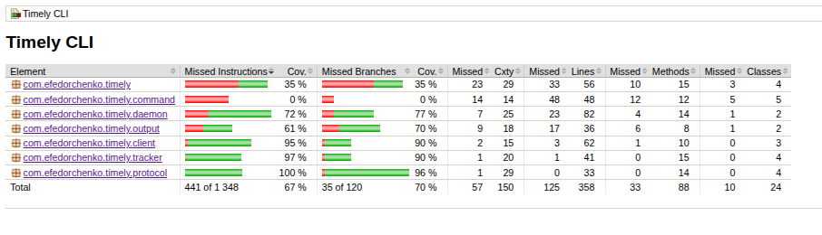

# Timely CLI

Консольный тайм-трекер. Запускаешь таймер, работаешь, останавливаешь — видишь сколько времени потратил.

## Быстрый старт

Приложение рассчитано на запуск как **native-image**. Готовые бинарники есть в артефактах релиза.

```bash
# Запустить daemon в фоне
artifact/v{version}/timely daemon

# Работаем
artifact/v{version}/timely start
artifact/v{version}/timely status
artifact/v{version}/timely stop

# Остановить daemon
artifact/v{version}/timely shutdown
```

Для удобства можно добавить симлинк:
```bash
sudo ln -s $(pwd)/timely /usr/local/bin/timely
```

> **Примечание:** команда `timely daemon` форкает процесс через `ProcessBuilder` и работает
> только с нативным бинарником. С JAR совместимость убрана (для упрощения).

### Сборка из исходников

```bash
# Native image (нужен GraalVM 25+)
mvn clean package -Pnative

# Обычный JAR (только для тестов, daemon не работает)
mvn clean package
```

### Запуск из IDEA

Используйте run-конфигурации из `.run/`:

1. Запустите **dev-daemon** и оставьте работать — поднимает daemon в виртуальном потоке.
2. Запускайте **run-start**, **run-stop**, **run-status** по очереди — каждый подключается к daemon по TCP и сразу завершается, как в проде.
3. Для остановки — **run-shutdown** или Stop на **dev-daemon**.

## Архитектура

Клиент-серверная архитектура: daemon хранит данные в памяти, CLI-команды общаются с ним по TCP.

### Prod-режим

```
┌─────────────────┐         TCP :52713         ┌─────────────────┐
│  timely start   │ ──────────────────────────>│                 │
│  timely stop    │ ──────────────────────────>│     Daemon      │
│  timely status  │ ──────────────────────────>│   (фоновый      │
│  timely shutdown│ ──────────────────────────>│    процесс)     │
└─────────────────┘                            └─────────────────┘
   Отдельные                                      Хранит Tracker
   процессы,                                      в памяти
   сразу завершаются
```

Каждая команда (`start`, `stop`, `status`) — отдельный процесс. Подключается к daemon, отправляет команду, получает ответ, завершается.

Daemon запускается командой `timely daemon`:
1. Форкает себя с флагом `--foreground`
2. Фоновый процесс запускает TCP-сервер
3. Основной процесс проверяет что daemon поднялся и завершается
4. Терминал свободен

### Запуск из IDEA (dev-режим)

```
┌─────────────────────────────────────────────────────────┐
│  dev-daemon (timely --dev)                              │
│  ┌──────────────────────────────────────────────────┐   │
│  │  DevDaemon.start()  →  DaemonServer (v-thread)   │   │
│  └──────────────────────────────────────────────────┘   │
│  main-поток припаркован, процесс живёт                  │
└─────────────────────────────────────────────────────────┘
                         ↑ TCP :52713
┌──────────────────┐  ┌─────────────────┐  ┌──────────────┐
│  run-start       │  │  run-stop       │  │  run-status  │
│  (завершается)   │  │  (завершается)  │  │ (завершается)│
└──────────────────┘  └─────────────────┘  └──────────────┘
```

## Структура проекта
```

src/main/java/com/efedorchenko/timely/
 ├── Main                    # Точка входа, picocli
 ├── AppProperties           # Конфигурация из application.properties (версия, daemon host/port, таймауты)
 ├── VersionProvider         # Настройка версии проекта для picocli
 │ 
 ├── client
 │    ├── DaemonClient               # TCP-клиент
 │    ├── DaemonNotRunningException
 │    ├── TrackerService             # Фасад: протокол + парсинг ответов
 │    ├── Printer                    # Интерфейс вывода результатов
 │    └── ConsolePrinter             # Реализация: печать в stdout
 │ 
 ├── command                 # Picocli-команды     
 │    ├── DaemonCommand      # timely daemon       
 │    ├── ShutdownCommand    # timely start        
 │    ├── StartCommand       # timely stop         
 │    ├── StatusCommand      # timely status       
 │    └── StopCommand        # timely shutdown     
 │ 
 ├── daemon
 │    ├── DaemonServer       # TCP-сервер, обработка команд
 │    └── DevDaemon          # Запуск daemon в виртуальном потоке (только для IDEA)
 │ 
 ├── format
 │    └── DurationFormatter  # Форматтер, "1h 2min 3sec"
 │ 
 ├── protocol
 │    ├── Protocol           # Константы и парсинг протокола
 │    └── StatusResponse     # pojo для статуса
 │ 
 └── tracker
      ├── StatusInfo         # Снимок состояния трекера, pojo
      ├── TimeSession        # Модель сессии (sealed interface)  
      ├── TimeTracker        # Интерфейс трекера 
      └── Tracker            # Реализация, хранит сессии
 
```

## Протокол

Текстовый, одна строка = одно сообщение.

**Команды (CLI → Daemon):**
```
ping
start
stop  
status
shutdown
```

**Ответы (Daemon → CLI):**
```
timely                          # pong
OK                              # start успех
OK 3723                         # stop успех (секунды сессии)
OK 120 3723 true                # status (current, total, running)
ERROR Timer is not running      # ошибка
BYE 3723                        # shutdown (total секунды)
```

## Сборка

```
# Обычный JAR (для тестов)
mvn clean package

# Native image (для использования)  
mvn clean package -Pnative
```

Требования для native image:
- GraalVM 25+ (`sdk install java 25.0.2-graalce`)

## Тестирование версии 1.0

Покрыта бизнес-логика (Tracker, Protocol, DurationFormatter) и интеграция клиент-сервер (DaemonServer, DaemonClient).
Не покрыты тонкие обёртки (Commands, DevDaemon) — осознанно, см. комментарии в коде.

```bash
# Для замера покрытия
mvn verify

# Результат в target/site/jacoco/index.html
```

## Что не реализовано (задел на будущее)

- **Проекты**: `start work`, `start study` — структура готова, но пока не используется
- **Персистентность**: данные в памяти, при остановке daemon теряются
- **Логирование**: метод `log()` в DaemonServer пустой, когда разрешат файлы — будет писать в лог
